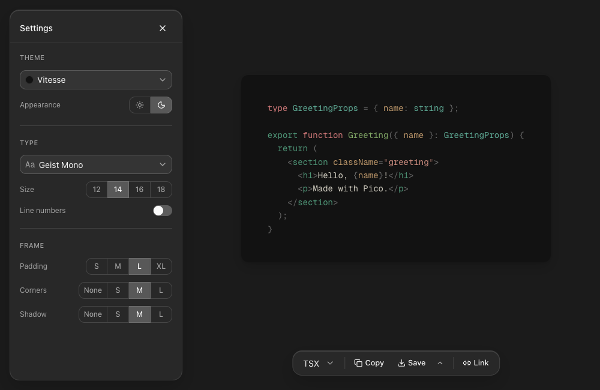

  

<h1 align="center">Pico</h1>

  <strong>Code, framed.</strong> 
  Turn a snippet into a picture.

## Quickstart

1. Paste code into the editor.
2. Choose a theme from the top-left Settings panel.
3. Export the image from the bottom dock.

## Features

- Automatic detection for common languages, with highlighting for 243 languages.
- Themes and fonts, including Japanese text support.
- Clipboard copy, PNG/SVG downloads, and URL sharing.
- No account required; editing and export run entirely in the browser.

## Development

See [Development](./docs/development.md) for setup, architecture, testing, and deployment.

## License

Pico is available under the [MIT License](./LICENSE).

The bundled subset of UDEV Gothic is available under the
[SIL Open Font License 1.1](./public/fonts/UDEVGothic-LICENSE.txt).
